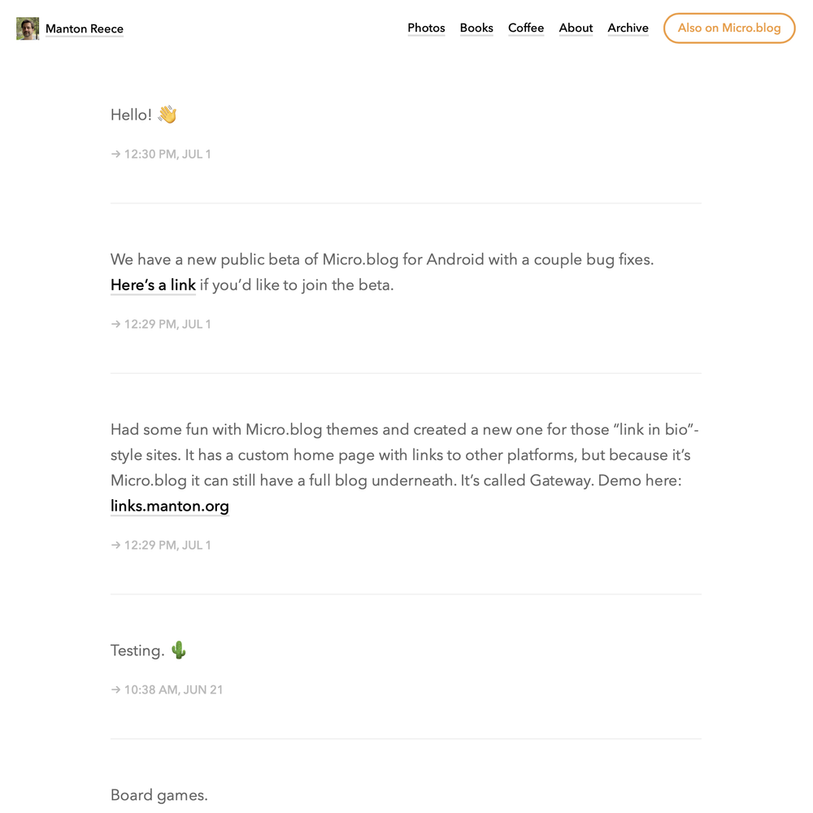

# Alpine theme for Micro.blog

Hugo theme for Micro.blog, based on Marfa theme, which was based on [NeoCactus](https://github.com/mmarfil/neocactus/fork) and [Cactus](https://github.com/eudicots/Cactus) for Jekyll. Mostly the same design as Marfa but with a more compact header.

